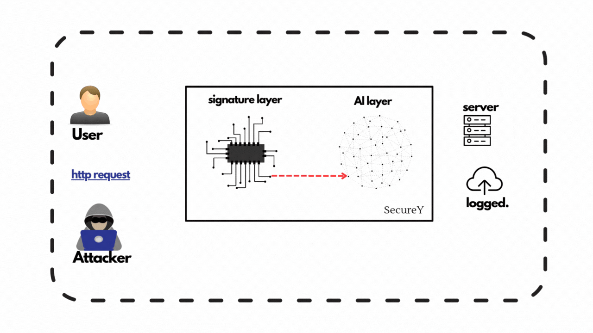

# Hybrid Web Application Firewall (SecureY)

## 📌 Project Overview

**SecureY** is a **Hybrid Web Application Firewall (WAF)** specifically tailored to detect and prevent both known and unknown cyberattacks on **e-commerce platforms**. The system integrates a traditional signature-based detection mechanism with a machine-learning-based anomaly detection model (LightGBM) to enhance web application security.

## Problem

Modern e-commerce platforms are frequently targeted by:
- SQL Injection (SQLi)
- Cross-Site Scripting (XSS)
- Zero-day exploits

Traditional WAFs rely on **static rules and signature matching**, making them ineffective against **evolving threats and obfuscation techniques**. Our approach overcomes these limitations by combining the speed of rule-based filtering with the intelligence of ML-driven anomaly detection.


## Architecure Diagram



##  Core Features

- **Layered Detection**:
  - **Signature Layer**: Detects known threats using pre-defined rules
  - **AI Layer**: Uses LightGBM to flag anomalous traffic patterns
- **Optimized for e-commerce** HTTP behavior
- **Efficient Logging** of all HTTP requests and detection decisions


##  Dataset Used

- **Dataset**: CSIC 2010 HTTP Dataset
- **Content**:
  - Realistic GET, POST, PUT requests
  - Includes SQLi, XSS, and other attack vectors
- **Key Extracted Features**:
  - `Parameter Lengths`
  - `Payload Entropy`
  - `Numeric-to-Text Ratio`
  - `Special Character Density`

> ❌ URI-related features were excluded due to low discriminative power in EDA.

##  Methodology

```text
Incoming HTTP Request
        │
        ▼
 ┌─────────────┐
 │ Rule Engine │  ← Signature-based filtering (Layer 1)
 └─────────────┘
        │
        ▼
 ┌──────────────────────┐
 │ Feature Extractor    │  ← Extracts behavioral features (Layer 2)
 └──────────────────────┘
        │
        ▼
 ┌──────────────────────┐
 │ LightGBM Classifier  │  ← ML model flags anomalies (Layer 3)
 └──────────────────────┘
        │
        ▼
┌───────────────────────┐
│ Log Decision & Action │ → Block or Allow request
└───────────────────────┘

```
[***DEMO VIDEO***](https://x.com/riyytech/status/1933239092101415005)

> 🛡️ SecureY — Bridging the gap between static firewalls and adaptive cybersecurity.
